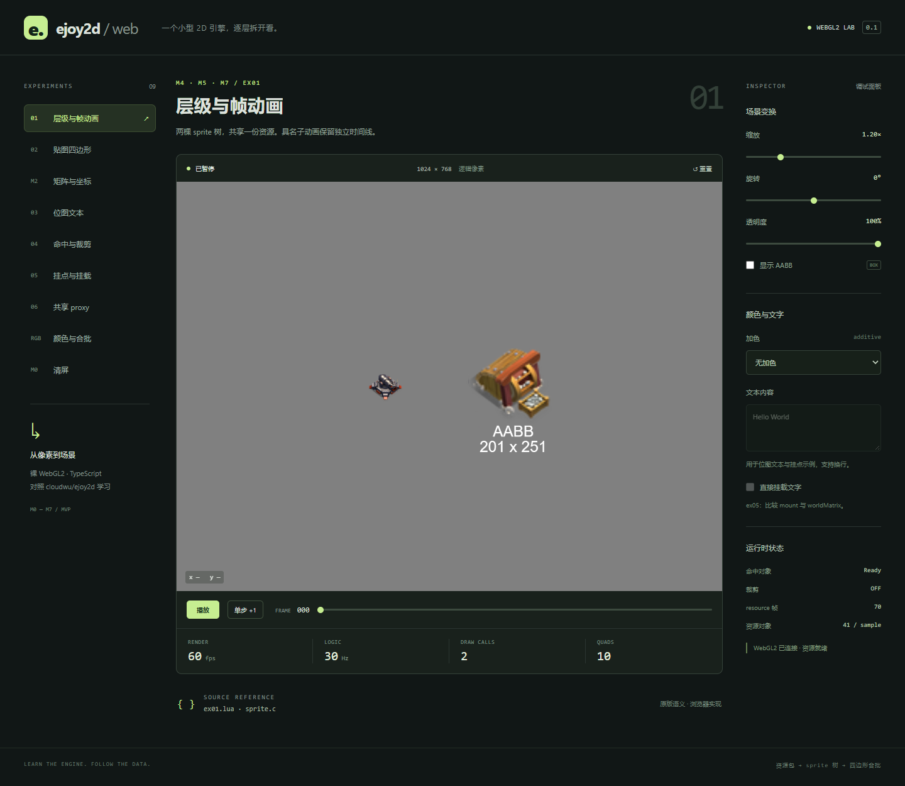

# ejoy2d-web

这是对照 [cloudwu/ejoy2d](https://github.com/cloudwu/ejoy2d) 用 TypeScript + WebGL2 重写核心 2D 能力的**学习项目，不是生产级引擎**。它用来把一条最小渲染管线讲清楚、跑起来，并和原版源码逐模块对照。不追求性能、兼容性或功能完备，也不适合直接拿去做游戏产品。已完成 [MVP 计划](docs/mvp-plan.md) 的 M0–M7，并提供 9 个交互示例。

## 能学到什么

跟着 `src/` 和页面示例，可以建立这些能力：

- **2D 引擎的最小骨架**：资源包 → Sprite 树 → 画家算法递归提交四边形。
- **仿射变换**：行向量 3×2 矩阵、缩放 → 旋转 → 平移，以及父子世界矩阵合成。
- **WebGL2 渲染**：shader、PPM/PGM 纹理上传、同纹理动态合批、混合模式、scissor 裁剪栈。
- **精灵系统**：帧动画与动作、命名挂点、动态挂载、命中测试、AABB。
- **主循环与输入**：30 Hz 固定逻辑帧和 rAF 渲染帧分开；指针在逻辑画布、CSS 尺寸和设备像素之间换算。
- **文本**：用 Canvas 生成位图字库，再当普通四边形绘制。
- **资源管线**：转换期用 Fengari 读 Lua 资源并展开共享矩阵，运行时只消费 JSON，浏览器里不再依赖 Lua VM。
- **怎么验收**：纯逻辑测试对照原版数值，再用浏览器做交互和像素核对。

各模块文件头标明原版对应源文件。差异、测试证据和仍属选做的范围见 [实现与验收记录](docs/implementation.md)。



## 运行

使用 Node.js 22.12+ 或 24+。本次验证环境为 Node.js 24.13.0。

```sh
npm ci
npm run dev
```

浏览器打开终端显示的本地地址。原版 sample 资源及转换后的 JSON 已随仓库提供，运行时不依赖原版仓库或 Lua VM。

```sh
npm run assets      # 从 assets-source/sample.lua 重新生成资源及转换报告
npm test            # 35 项逻辑测试
npm run build       # 严格类型检查 + 生产构建
npm run test:e2e    # 7 项浏览器/像素验收
npm run check       # 转换、逻辑测试、构建、浏览器验收
npm run preview     # 预览 dist 生产构建
```

浏览器测试在 Windows 默认使用本机 Microsoft Edge；其他系统使用 Playwright Chromium，首次运行先执行 `npx playwright install chromium`。可通过 `PLAYWRIGHT_CHANNEL` 指定已安装的浏览器。测试使用软件 WebGL，截图写入 `docs/screenshots/`。

## 示例与操作

| 示例 | 内容 |
| --- | --- |
| ex01 | cannon/mine 层级动画、具名子节点独立帧、AABB 多行文本 |
| ex02 | 原版硬编码四边形的贴图与 UV |
| Matrix | 平移、旋转、非均匀缩放、镜像 |
| ex03 | mine 的 Canvas 位图文本；粒子属于选做 M8 |
| ex04 | 点击 label 修改文本，点击 panel/矿场切换裁剪，空白返回 Not Hit |
| ex05 | anchor.worldMatrix 跟随；可切换为直接 mount 文字 |
| ex06 | 同一个 proxy/炮管挂载到两门炮 |
| Color | 乘色、半透明、加色和动态合批 |
| Clear | 灰色清屏与 30 Hz 固定逻辑帧 |

页面支持暂停、单步、帧拖动、缩放、旋转、透明度和 AABB 显示。逻辑画布固定为 1024×768，指针和 scissor 会换算 CSS 尺寸及设备像素密度。加上 `?demo=ex04&paused=1` 可直接进入暂停的指定示例。

控制台中的 `window.ejoy2d` 暴露真实的 `renderer`、`game`、`scene`、`options`、`select(id)` 和 `render()`，方便逐帧学习。它是本地演示的调试接口。

## 代码入口

| 路径 | 职责 |
| --- | --- |
| `src/core/` | 行向量矩阵、颜色、PPM、WebGL2 状态、纹理、合批、scissor |
| `src/sprite/` | 资源校验、包加载、Sprite 树、动作/帧、挂载、命中、AABB |
| `src/text/` | Canvas 文本布局和纹理缓存 |
| `src/app/` | 固定步长循环与 Pointer Events |
| `src/examples/scenes.ts` | ex01–ex06 的 TypeScript 对照实现 |
| `tools/convert-assets.mjs` | 用 Fengari 在转换期读取 Lua 资源，展开共享矩阵池 |
| `test/` / `e2e/` | 纯逻辑回归 / 浏览器交互与真实 GPU 像素验证 |

阅读 [实现与验收记录](docs/implementation.md) 可查看逐模块差异、测试证据与仍属 M8 的范围。

## 资源来源

`assets-source/sample.lua`、`public/assets/sample.1.ppm/.pgm` 来自 cloudwu/ejoy2d 的 `examples/asset`，遵循原项目 MIT 许可。保留原版权声明于 [assets-source/LICENSE.ejoy2d](assets-source/LICENSE.ejoy2d)。各核心模块文件头标明原版对应源文件。
